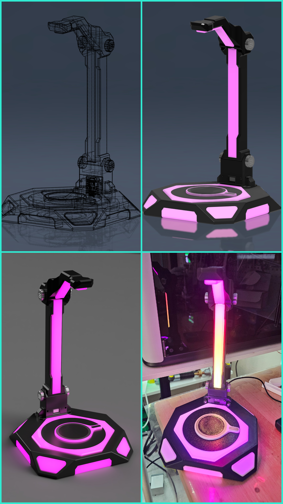
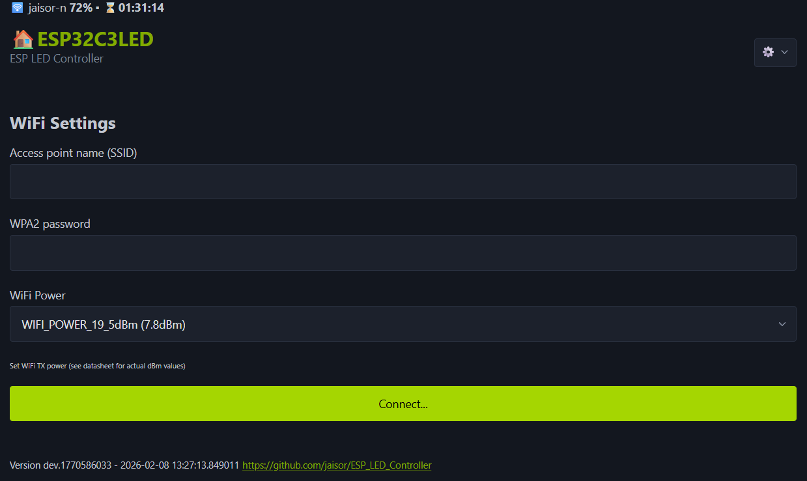

# Over-engineered Headphone Stand with Wireless Phone Charger


https://makerworld.com/en/models/2347791-over-engineered-headphone-stand-and-phone-charger#profileId-2567275

## Description
* Headphone stand
* Wireless phone charger with Magsafe
* LEDs driven by an ESP32C3 with OLED display accessible via wifi/web to change mode, brightness and more

## Getting the firmware

You can obtain `firmware.bin` in one of two ways:

### Option 1: Build from source
1. Clone this repository and install [PlatformIO](https://platformio.org/).
2. Build the firmware:
   ```bash
   pio run -e esp32c3
   ```
3. The built binary is at `.pio/build/esp32c3/firmware.bin`.

### Option 2: Download a pre-built binary
1. Go to the GitHub repository: https://github.com/jaisor/ESP_LED_Controller/tree/led_headphone_stand
2. Download `firmware.bin` from the latest **release tag** or from the **build artifacts** attached to the most recent workflow run.

## Firmware flashing

### Initial (USB)
1. Connect the ESP32C3 via USB and flash using `esptool`:
   ```bash
   esptool.py --chip esp32c3 --port <COM_PORT> --baud 921600 write_flash 0x0 firmware.bin
   ```
   Replace `<COM_PORT>` with your serial port (e.g. `COM3` on Windows, `/dev/ttyUSB0` on Linux).

   Alternatively, if you built from source, use PlatformIO's built-in upload:
   ```bash
   pio run -e esp32c3 -t upload
   ```

### OTA
1. Open a browser and navigate to `http://<device_ip>/update` (the device IP is shown on the OLED display or in serial output).
2. The ElegantOTA interface will load — select `firmware.bin` and click **Update**.
3. The device will flash the new firmware and reboot automatically.

## WiFi connection


1. On first boot (or after a factory reset), the device has no saved WiFi credentials. It will automatically create a **soft access point** named `ESP32C3LED_<device_id>` with the default password `password123`.
2. Connect to that network from your phone or computer.
3. Open a browser and go to `http://192.168.4.1/wifi`.
4. Enter your home WiFi network SSID and password, then submit the form.
5. The device will save the credentials to EEPROM, reboot, and connect to your WiFi network.
6. Once connected, the device's IP address is displayed on the OLED screen. Use that IP to access the web UI and API.

> **Tip:** If the device ever fails to connect to the saved network, it will fall back to creating the soft AP again so you can reconfigure it.

## Factory Reset
If the device is misbehaving or you want to start fresh, you can trigger a factory reset by **power-cycling the device 3 times within 2 seconds** (plug/unplug rapidly). On the third boot the firmware detects the rapid reboot pattern, wipes EEPROM, and restores all settings to defaults. After a factory reset the device will boot with no saved WiFi credentials and create its soft access point again (see [WiFi connection](#wifi-connection) above).

You can also trigger a factory reset from the web UI by sending a POST request to `/factory_reset`.

## LED configuration


The main page (`/`) lets you control all LED-related settings:

| Setting | Description |
|---|---|
| **LED Type** | The LED chipset type (e.g. WS2812B, WS2811, etc.). Changing this requires a reboot. |
| **LED Mode** | The active animation pattern. Each registered mode has an index shown in the mode list. |
| **Brightness** | Global LED brightness (0–100%). |
| **Delay (ms)** | Frame delay in milliseconds — lower values produce faster animations. |
| **Strip Size** | Number of LEDs on the strip. Changing this requires a reboot. |
| **Cycle Mode (s)** | Seconds between automatic mode changes. Set to 0 to disable auto-cycling. |
| **Mode Cycling Selection** | Choose to cycle through all modes or provide a comma-separated list of specific mode indices. |

### Power-save schedule
The power-save feature lets you dim the LEDs during certain hours (e.g. overnight):

| Setting | Description |
|---|---|
| **PS Brightness** | Brightness multiplier during power-save hours (0–100%, applied on top of the global brightness). |
| **PS Start Hour** | Hour of the day (0–23) when power-save begins. |
| **PS End Hour** | Hour of the day (0–23) when power-save ends. |

> **Important:** The power-save schedule relies on knowing the current time. This requires an active **WiFi connection to the internet** so the device can sync with an NTP server. You must also set your correct **timezone** on the `/device` page — otherwise the hours will not match your local time.

## Other device configuration


The device page (`/device`) provides general device settings:

| Setting | Description |
|---|---|
| **LED Enabled** | Master on/off toggle for the LED strip. |
| **Device Name** | A friendly name for the device (stored in EEPROM). |
| **Timezone** | Select your local timezone from the dropdown. This is used by the NTP time sync and directly affects the power-save schedule described above. Daylight saving time adjustments are handled automatically via POSIX timezone rules. |

The device page also provides a **Reboot** and **Factory Reset** option.

## BOM:
* LED strip - https://www.amazon.com/dp/B088FKZWDQ
* LED ring - https://www.amazon.com/dp/B08GPL6N37 
* ESP32C3 with OLED - https://www.amazon.com/dp/B0F37JWCDW
* Wireless charger module - https://www.amazon.com/dp/B0BRMMYZR2
* Magsafe magnets - https://www.amazon.com/dp/B09FZ5Z7S4 
* 5v stepdown, should work with 5v input too - https://www.amazon.com/dp/B07MS1ND5M 
* M4 screws 16mm - https://www.amazon.com/dp/B07CK5C5MM (smaller sizes will work too like 12mm, 10mm)
* M3 screws 6mm - https://www.amazon.com/B01B1OD0IC 
* Glue - anything that will hold the PLA in place like CA, superglue, E6000, all purpose glue, etc. https://www.amazon.com/dp/B00C32MKLK
