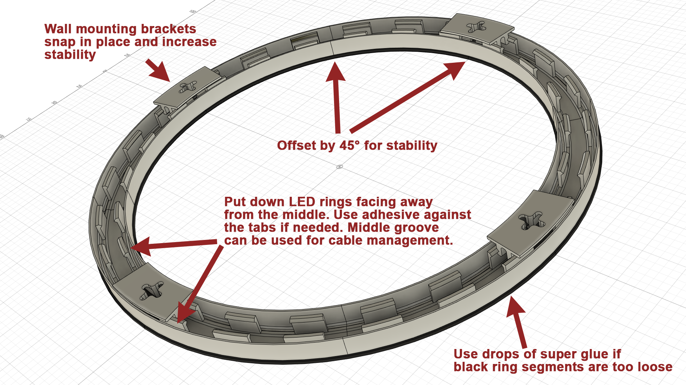
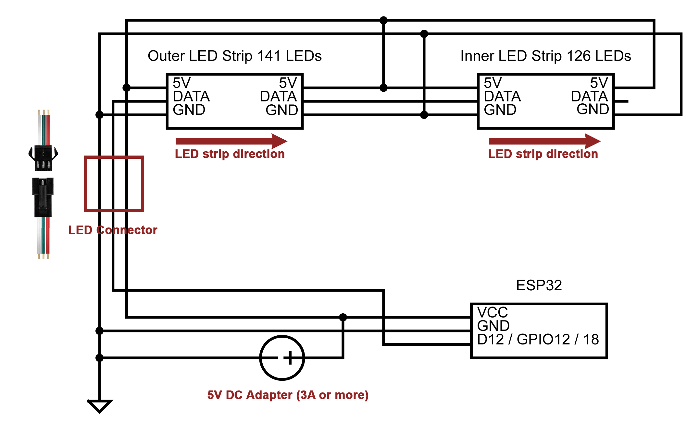

# RingLight ESP LED Controller

## Features
* Two LED rings - outer (141 LEDs) and inner (126 LEDs) wired up in series for a total of 267 LEDs
* Controlled by ESP32 (most stable). Code is compatible with ESP8266, but I was suffering stability issues with wifi and longer LED strips.
* WiFi connected and managed
    * creates a default AP, listening to http://192.168.4.1
    * capable of joining existing 2.4GHz networks
    * serves a webpage for managing LED - strip size, mode, brightness
* Firmware update over WiFi - new `firmware.bin` file can be uploaded at `/update` after the IP address

## Components
* ESP32 - https://www.amazon.com/gp/product/B086MGH7JV
* JST SM 3PIN LED Connector - https://www.amazon.com/gp/product/B075K4HLTQ
* DC power connector - https://www.amazon.com/gp/product/B01N8VV78D
* WS2812B LED strip high density strips 144 LEDs per strip x 2 - https://www.amazon.com/gp/product/B088FKZWDQ
* DC 5v adapter - https://www.amazon.com/gp/product/B078RXZM4C

## 3D filament 
I used the ones below but likely many others will work. Make sure the white is translucent enough, print a 3 layer sheet and put it in-front of some LEDs.
* ESUN PLA+ warm white - https://www.amazon.com/gp/product/B01EKEMIIS
* ERYONE Matte PLA black - https://www.amazon.com/gp/product/B08HX1XF55

## Assembly and wiring

Print 4 of each:
* [Dark Ring](stl/DarkRing.stl)
* [Light Ring](stl/LightRing.stl)
* [Bridge Hanger](stl/Hanger.stl)

Assemble as described below. Rotate the light ring segments by 45 degrees so they join in the middle of the dark ring segments. 
This improves stability. If loose-fitting, use a few drops of superglue to set the dark and light rings together.

Cut the two LED strips to 141 and 126 LEDs. Keep as many of the existing wires and connectors as possible. 
Wire the strips data in series - outer first then inner. The beginning of the outer ring data pin goes to the connector data pin. 
Join the power wires in parallel: 5V/VCC together to the 5V connector pin; GND(-) together to GND on connector pin. 
Providing power to both start and ends of the strips reduces voltage sag and ensures even light at all brightness levels.

By default in `Configuration.h` the LEDs data is connected to pin 12 on the ESP, but most other GPIO pins can be used if needed.

__LED_PIN_STRIP = 12__ - GPIO12 - above VIN (5V), GND and GPIO13

Solder the power and data cables between the LED connector, ESP32 and DC connector as shown below, using the basic 3D printable enclosure.
The board is mounted above the DC connector with 3mm screws

Enclosure STL files. Print in PLA, PETG or any other hard filament.
* [ESP32 Case STL](stl/ESP32Case.stl)
* [ESP32 Lid STL](stl/ESP32Lid.stl)

## Configuration.h

This file configures various default settings, like:
* ESP pin used to drive the LED data (defaults are referenced below)
* WiFi AP name/password
* LED strip type, size, default brightness