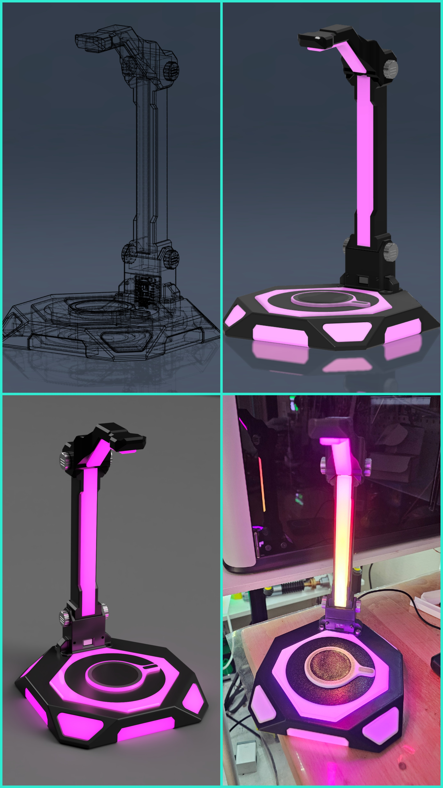
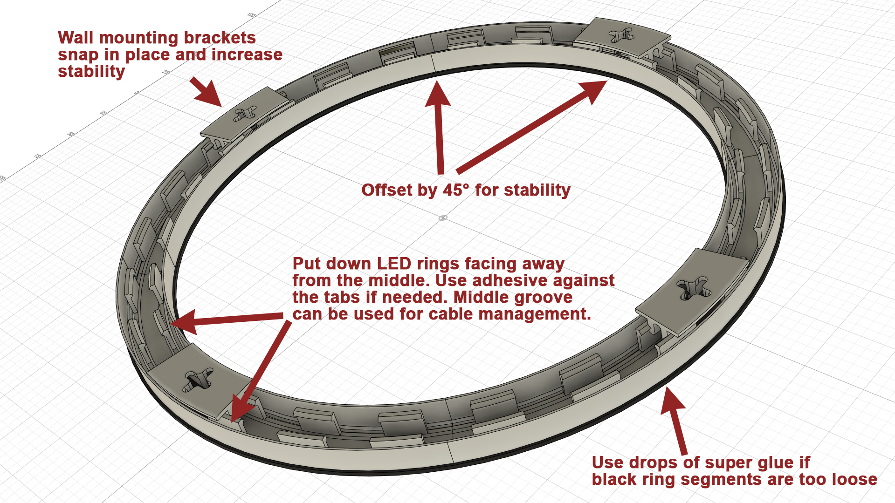
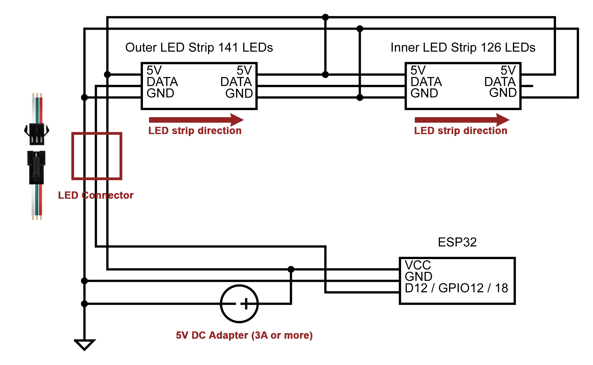
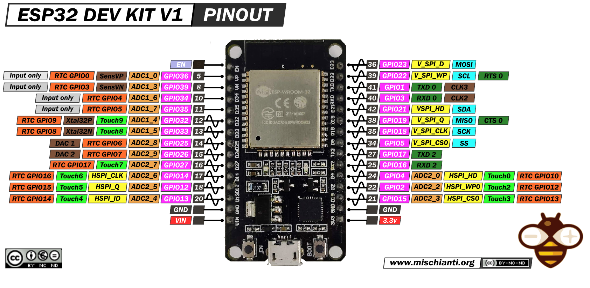

# RingLight ESP LED Controller

## Features
* Two LED rings - outer (141 LEDs) and inner (126 LEDs) wired up in series for a total of 267 LEDs
* Controlled by ESP32 (most stable). Code is compatible with ESP8266, but I was suffering stability issues with wifi and longer LED strips.
* WiFi connected and managed
    * creates a default AP, listening to http://192.168.4.1
    * capable of joining existing 2.4GHz networks
    * serves a webpage for managing LED - mode, brightness, cycling and power-save hours
    * LED setup page (`/led`) - layout (single strip, dual strip, ring light), LED count, data pin(s), chipset and color order
    * configuration export and import as a JSON file on the Device page
    * Mode Configurator (`/modes`) - define up to 8 custom modes: name, color palette (up to 8 colors, smooth or hard transitions), effect, direction, speed and palette repeats. Effects depend on the layout: color fade, edge to edge and twinkle everywhere, center to edge on strips, circling, ring halves and ring to ring on a ring light. A mode's **Code** button shows it as a short JSON code that can be pasted into another controller's configurator
* MQTT and Home Assistant (Device page) - set the broker and the controller shows up in Home Assistant through MQTT discovery as a light: on/off, brightness, and the modes of the current layout (custom modes included) as effects, plus WiFi signal and IP diagnostics. Other MQTT clients can use the same topics, see below
* Firmware update over WiFi - new `firmware.bin` file can be uploaded at `/update` after the IP address

## Components
* ESP32 - https://www.amazon.com/gp/product/B086MGH7JV
* JST SM 3PIN LED Connector - https://www.amazon.com/gp/product/B075K4HLTQ
* DC power connector - https://www.amazon.com/gp/product/B01N8VV78D
* WS2812B LED strip high density strips 144 LEDs per strip x 2 - https://www.amazon.com/gp/product/B088FKZWDQ
* DC 5v adapter - https://www.amazon.com/gp/product/B078RXZM4C

## 3D filament 
I used the ones below but likely many others will work. Make sure the white is translucent enough, print a 3 layer sheet and put it in-front of some LEDs.
* ESUN PLA+ warm white - https://www.amazon.com/gp/product/B01EKEMIIS
* ERYONE Matte PLA black - https://www.amazon.com/gp/product/B08HX1XF55

## Assembly and wiring

Print 4 of each:
* [Dark Ring](stl/DarkRing.stl)
* [Light Ring](stl/LightRing.stl)
* [Bridge Hanger](stl/Hanger.stl)

Assemble as described below. Rotate the light ring segments by 45 degrees so they join in the middle of the dark ring segments. 
This improves stability. If loose-fitting, use a few drops of superglue to set the dark and light rings together.

Cut the two LED strips to 141 and 126 LEDs. Keep as many of the existing wires and connectors as possible. 
Wire the strips data in series - outer first then inner. The beginning of the outer ring data pin goes to the connector data pin. 
Join the power wires in parallel: 5V/VCC together to the 5V connector pin; GND(-) together to GND on connector pin. 
Providing power to both start and ends of the strips reduces voltage sag and ensures even light at all brightness levels.

By default the LEDs data is connected to pin 12 on the ESP, but most other GPIO pins can be used if needed - pick the pin on the LED setup page.

__LED data pin = 12__ - GPIO12 - above VIN (5V), GND and GPIO13

After first boot, open `http://<device_ip>/led` (or ⚙️ → LED Setup) and set:
* Layout: __Ring light__
* Total LEDs: __267__, outer ring LEDs: __141__
* Chipset __WS2812B__, color order __GRB__

The ring modes (Slava Ukraini, Dual Ring, Ring ... Colors, Honey Amber, Ring Pride) only show up with the ring light layout.

Solder the power and data cables between the LED connector, ESP32 and DC connector as shown below, using the basic 3D printable enclosure.
The board is mounted above the DC connector with 3mm screws

Enclosure STL files. Print in PLA, PETG or any other hard filament.
* [ESP32 Case STL](stl/ESP32Case.stl)
* [ESP32 Lid STL](stl/ESP32Lid.stl)

## Configuration.h

This file configures compile-time features and the defaults used after a factory reset, like:
* default LED data pin(s) and the list of GPIOs offered on the LED setup page
* WiFi AP name/password
* default LED layout, strip size, color order and brightness

Everything LED-hardware related can be changed at runtime on the LED setup page.
## MQTT

Enable it on the Device page by setting the MQTT server (and username/password if the broker requires one - the Home Assistant Mosquitto add-on does). Topics live under `<base topic>/<device id>`, both shown on the Device page:

| Topic | Direction | Payload |
| --- | --- | --- |
| `.../availability` | device → | `online` / `offline`, retained |
| `.../state` | device → | `{"state": "ON", "brightness": 0-255, "color_mode": "brightness", "effect": "<mode name>"}`, retained |
| `.../set` | → device | any of `{"state": "ON"/"OFF", "brightness": 0-255, "effect": "<mode name>"}` |
| `.../config` | → device | configuration JSON, same fields as the Device page backup file; saved, and the device reboots for WiFi, MQTT or LED hardware changes |
| `.../json` | device → | telemetry (IP, RSSI, uptime, mode, ...), every 5 minutes, retained |

With Home Assistant discovery enabled the device publishes its entities to `homeassistant/light/<device id>/config` and `homeassistant/sensor/<device id>_*/config`, and re-publishes them when Home Assistant restarts or the mode list changes.

## Migrating to the larger app partitions

Firmware for the `esp32`, `esp32c3` and `esp32s3` environments is built for `min_spiffs.csv` (two 1.9MB app slots); it no longer fits the 1.25MB slots of the framework's `default.csv` that older builds used. A normal OTA update can't fix that - it never rewrites the partition table - so `/update` on an older device rejects the new `firmware.bin` (safely, nothing changes). Flash over USB where you can; for devices that are hard to reach there is a one-off migrator firmware:

1. Build it for the board: `pio run -e esp32_migrator` (or `esp32c3_migrator`, `esp32s3_migrator`). The Xiao ESP32-S3 doesn't need it - its 8MB layout didn't change.
2. Upload `.pio/build/<env>_migrator/firmware.bin` through the device's existing `/update` page.
3. The migrator joins the saved WiFi network (or opens an access point `<name>_<chip id>_migrator`, password `password123`, at http://192.168.4.1) and shows the current partition table. Settings are only read, never changed.
4. Click **Migrate partition table**. It writes `min_spiffs.csv` to the partition table, verifies it and reboots into itself.
5. Upload the normal `firmware.bin` on the migrator's page. The controller comes back with its settings.

The migrator only writes the table when it recognizes `default.csv`, refuses on flash encryption or secure boot, and puts the old table back if the write doesn't verify. The write itself takes a fraction of a second, but a power cut during it leaves a board that needs USB - so try it on a board within USB reach first.
